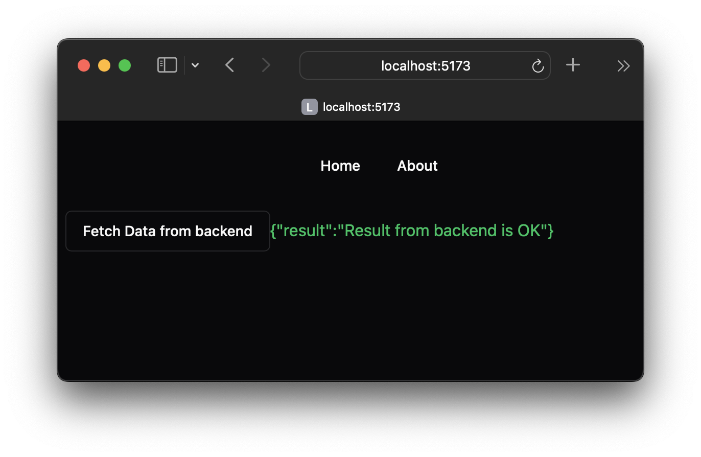

Related [blog post](https://hboon.com/terraform-and-kamal-for-digital-ocean-demo-repositories/).

This is a demo repo for configuring [Kamal](https://kamal-deploy.org) for a node.js/bun frontend + backend + database stack, running on a single physical server.

This is a starting point for a project with more than 1 HTTP server (eg. 1 frontend + 1 backend) and a backend service like a database or Redis/caching system. It should apply to React/Vue/Svelte + a node.js backend.

This is in contrast to dhh's introduction to Kamal video which shows a single go web server (which is more similar to both the frontend and backend being served by Rails)
d   
You will want to have a server provisioned before proceeding with the section [Deploy to Server with Kamal](https://github.com/hboon/kamal-frontend-backend-demo#deploy-to-server-with-kamal) below. I have a [Terraform demo repo for provisioning a Digital Ocean droplet](https://github.com/hboon/terraform-do-demo) that helps to do that.

Run Locally
===

It'll be good to see how the frontend and backend works before deploying to a server.

You'll want to install `bun` (because I copied this from my project). You are free to just use node.js, but you'll need to make a few modifications.

Frontend
---
At the project root,

1. `cd frontend`
2. Copy `.env-sample` and create a new called `.env`
3. Create a file called `.env` with this one line:

    ```
    VITE_BACKEND_HOST=http://localhost:4001
    ```

4. `pnpm i`
5. `pnpm run dev`

Backend
---
At the project root,

1. `cd backend`
2. Copy `.env-sample` and create a new called `.env`
3. Create a file called `.env` with this contents:

    ```
    NODE_ENV=development
    LOG_LEVEL=info
    PORT=4001
    DB_USER=not used
    DB_DATABASE=not used
    FRONTEND_HOSTNAME=http://localhost:5173
    ```

4. `pnpm i`
5. `pnpm run dev`

While the backend `ENV` setup defines variables for the database, the database is not created nor used. It's however created by Kamal on the server, so you can connect to it directly for testing the Kamal setup.

Visit <http://localhost:5173> and click the "Fetch Data from backend" button, you should see this:



This means your frontend and backend are working together correctly locally.

Deploy to Server with Kamal
===

You'll want to configure 2 (sub)domains pointing to your server IP address with your DNS server. Probably a pair of A records. There's a good chance you would edit these records if you provision a new server and try a few times. So keep the TTL low (only) for now (120s). e.g of the A records:

```
frontend -> 1.2.3.4 //for frontend.mydomain.com
backend -> 1.2.3.4 //for backend.mydomain.com
```

You will use this values for `FRONTEND_DOMAIN` and `BACKEND_DOMAIN` below. `FRONTEND_HOSTNAME` will look something like `https://frontend.mydomain.com`.

Frontend
---
At the project root,

1. `cd frontend`
2. Copy `.env-sample` and create a new called `.env-prod`
3. Modify the values in `.env-prod` to match your environment. You only need to modify those marked with `<` and `>`

Backend
---
At the project root,

1. `cd backend`
2. Copy `.env-sample` and create a new called `.env-prod`
3. Modify the values in `.env-prod` to match your environment. You only need to modify those marked with `<` and `>`

The ENV values for Kamal are tucked in `backend/.env-prod` for convenience.

Running Kamal
---
Make sure the server is accessible (i.e. up and running) before proceeding. If you are using my [Terraform demo repo](https://github.com/hboon/terraform-do-demo), remember that it reboots. You want to wait until after it reboots.

At the project root,

1. Run `kamal setup`

    If it works, it should just take a few minutes. When it's done, do:

2. Visit <https://FRONTEND_DOMAIN> and click the "Fetch Data from backend" button, you should see the screenshot above.

    This means your frontend and backend are working together correctly on your server.

3. Click the `About` link

    If the contents of the page changes to `About page`, then it means the Kamal configuration to make our web server rewrite URLs is working correctly.

Testing Database (Accessory) Connectivity
---

If you have postgres installed locally:

1. Run `ssh -N -l kamal -L 5433:<IP address>:5432 <IP address>`
2. Wait a few seconds
3. Open another terminal
4. Run `psql -p 5433 -h localhost -U db_user -d db_name` (and type `db_password` as the password)

    You should be connected to the database

If you kill (`ctrl-c`) the `ssh` command above and then run:

`psql -p 5432 -h <IP address> -U db_user -d db_name`

The connection should fail. This indicates the firewall on the server is blocking the connection correctly. You can only connect to the database via the server itself as the jump server via ssh.

A similar configuration would work for other storage accessory like Redis and memcached.

## Tips and Troubleshooting

`kamal setup -v` is useful for troubleshooting.

A few common cases:

* `kamal setup` fails quickly — Check if the server is accessible and booted up.
* login to Docker registry fails — Check if your server has outgoing TCP access (might be a firewall misconfiguration)
* `web` component fails health check — The server doesn't finish building and starting up the web component fast enough. Look for `deploy_timeout` in `config/deploy.yml` and increase it (but you should figure out why it's taking so long)
